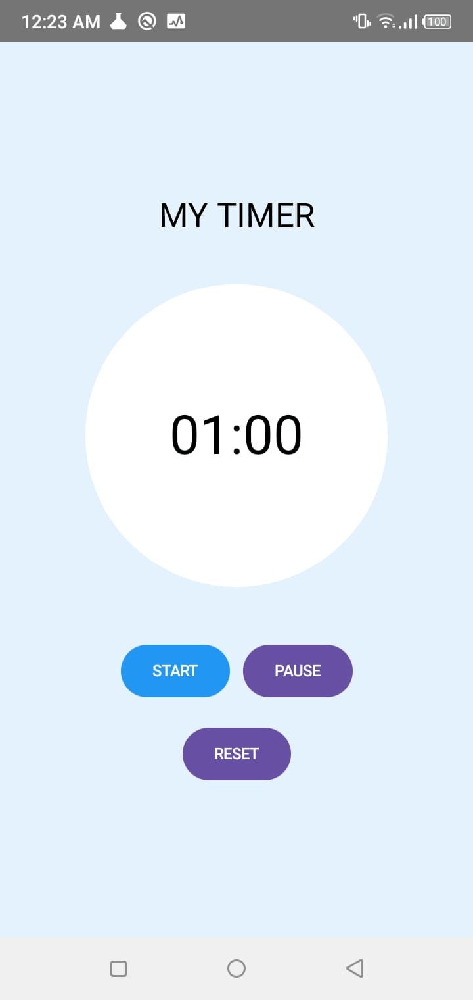

# Timer App

## About the App

Timer App is a simple Android countdown timer developed using Kotlin and Jetpack Compose in Android Studio. The app allows users to start, pause, and reset a countdown timer through a simple mobile interface.

## Screenshot

## Project Structure

This Timer App is developed using Kotlin and Jetpack Compose in Android Studio. The main application logic and user interface are implemented in `MainActivity.kt`. The `TimerApp()` composable manages the timer state, displays the countdown, and provides Start, Pause, and Reset buttons. `LaunchedEffect` and Kotlin Coroutines are used to update the timer every second. The project follows a simple Android activity-based structure.

## Technologies Used

* Kotlin
* Android Studio
* Jetpack Compose
* Kotlin Coroutines

## Features

* Start Timer
* Pause Timer
* Reset Timer
* Countdown Display
* Simple Mobile UI

## OWASP Mobile Top 10

### 1. M2 – Inadequate Supply Chain Security

The app uses Android and Jetpack Compose dependencies, so trusted and updated libraries should be used to reduce security risks.

### 2. M8 – Security Misconfiguration

The app should use proper Android configuration and only the permissions that are actually required.

## Question

Why did Android fail to install my APK with "Requested internal only, but not enough space" even though the APK file itself was not very large?
